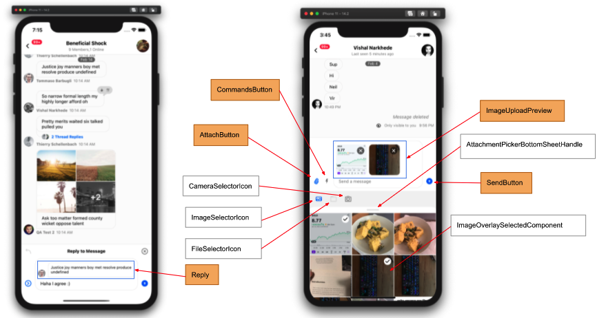

The `AttachButton` is the UI component for displaying the attach button.
This component must be used as child of `Channel` component.

 <!-- Replace with proper screenshot -->

## Basic Usage

You can have a custom attach button component by setting the `InputButtons` prop on any of its parent UI components or setting the `AttachButton` on the `Channel` component.

```jsx
import { Channel } from 'stream-chat-react-native';

const CustomAttachButton = ({ displayName }) => {
    return (
       <Button
            onPress={openAttachmentPicker}
            title="Attach"
        />
    );
}

<Channel AttachButton={CustomAttachButton} />
```